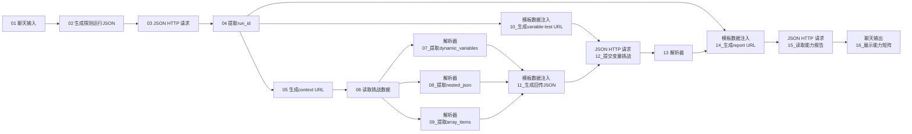

# 流程 00：平台能力探测

## 流程信息

- 平台智能体 / 工作流名称：`MoldGuard-平台能力测试`
- Flow ID：`dc8b6510-f2f3-41ee-8f1e-88af4bc9a762`
- 当前可见节点数：16
- 当前连线数：19
- 输入示例：`PROBE-20260814-001`
- 后端地址：`https://moldguard.oracle.19970219.xyz`
- 验证能力：P01 GET/POST、P02、P03、P04、P14
- 平台实装核对日期：`2026-08-15`

P04 只验证数组能够原样回传，不代表平台循环节点能展开 HTTP 响应中的数组。

本流程是原生能力证据链，必须保持以下 16 个平台原生节点和 19 条连线。不要使用 MoldGuard 自定义节点替换 HTTP、模板或解析器，否则 P01、P02、P03、P04、P14 将失去 `PASS_NATIVE` 的直接证据。单输出自定义节点只用于流程 01；旧版适配器只为历史备份和回退保留。

## 节点清单

| 编号 | 节点类型 | 节点名称 |
|---:|---|---|
| 01 | 聊天输入 | `聊天输入` |
| 02 | 模板数据注入 | `生成探测运行JSON` |
| 03 | JSON HTTP 请求 | `JSON HTTP 请求` |
| 04 | 解析器 | `提取run_id` |
| 05 | 模板数据注入 | `生成context URL` |
| 06 | JSON HTTP 请求 | `读取挑战数据` |
| 07 | 解析器 | `07_提取dynamic_variables` |
| 08 | 解析器 | `08_提取nested_json` |
| 09 | 解析器 | `09_提取array_items` |
| 10 | 模板数据注入 | `10_生成variable-test URL` |
| 11 | 模板数据注入 | `11_生成回传JSON` |
| 12 | JSON HTTP 请求 | `12_提交变量挑战` |
| 13 | 解析器 | `解析器` |
| 14 | 模板数据注入 | `14_生成report URL` |
| 15 | JSON HTTP 请求 | `15_读取能力报告` |
| 16 | 聊天输出 | `16_展示能力矩阵` |

## 节点图



## 核心配置

### 01 聊天输入

只使用英文字母、数字和短横线：

```text
PROBE-20260814-001
```

### 02 生成探测运行JSON

```json
{
  "platform_name": "competition-agent-platform",
  "tester": "moldguard-team",
  "mode": "STRICT",
  "client_request_id": "{probe_tag}-create-run"
}
```

`probe_tag ← 01.message`

### 03 JSON HTTP 请求（创建探测运行）

- 方法：`POST`
- URL：`https://moldguard.oracle.19970219.xyz/api/v1/probe/runs`
- 请求头：`Content-Type: application/json`
- Body：`02.text`

### 04 提取 run_id

- 模式：`Parser`
- 输入：`03.data`
- 模板：`{body[data][run_id]}`

### 05 生成 context URL

```text
https://moldguard.oracle.19970219.xyz/api/v1/probe/runs/{run_id}/context
```

`run_id ← 04.message`

### 06 读取挑战数据

- 方法：`GET`
- URL：`05.text`

### 07、08、09 三个解析器

- `07`：`{body[data][challenge][dynamic_variables]}`
- `08`：`{body[data][challenge][nested_json]}`
- `09`：`{body[data][challenge][array_items]}`
- 三个输入都连接 `06.data`

### 10_生成variable-test URL

```text
https://moldguard.oracle.19970219.xyz/api/v1/probe/runs/{run_id}/variable-test
```

`run_id ← 04.message`

### 11_生成回传JSON

```json
{
  "dynamic_variables": {dynamic_variables},
  "nested_json": {nested_json},
  "array_items": {array_items},
  "capability_results": [],
  "client_request_id": "{probe_tag}-variable-roundtrip"
}
```

变量外面不要加双引号：

- `dynamic_variables ← 07.message`
- `nested_json ← 08.message`
- `array_items ← 09.message`
- `probe_tag`：当前平台未连接，输入为空

当前画布因此是 19 条连线。节点 11 的模板仍包含 `"client_request_id": "{probe_tag}-variable-roundtrip"`，所以当前实装会使用空批次前缀。若要让每个探测批次生成独立幂等键，应新增：

```text
聊天输入.message -> 11_生成回传JSON.probe_tag
```

补线后画布将变为 20 条连线；在平台实际补线前，总清单和本文顶部仍按已核验的 19 条记录。

### 12_提交变量挑战

- 方法：`POST`
- URL：`10.text`
- Body：`11.text`

### 13 解析器（提取 matched）

- 模式：`Parser`
- 输入：`12.data`
- 模板：`{body[data][matched]}`

### 14_生成report URL

```text
https://moldguard.oracle.19970219.xyz/api/v1/probe/runs/{run_id}/report?matched={matched}
```

- `run_id ← 04.message`
- `matched ← 13.message`

### 15、16

- `15_读取能力报告`：GET，URL=`14.text`
- `16_展示能力矩阵`：输入=`15.data`

## 验收

最终报告中以下 6 项应为 `PASS_NATIVE`：

```text
P01_GET
P01_POST
P02
P03
P04
P14
```

保存本轮 `run_id` 作为本次平台原生能力探测证据。当前流程 01 定时版不再依赖该 `run_id`。
