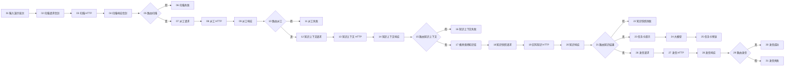

# 流程 01：预警派工与知识随单（V2 单输出）

## 流程信息

- 平台流程名称：`MoldGuard_01_预警派工与知识随单_V2`
- 节点数：31
- 预期连线数：36
- 输入示例：`DEMO-20260814-001`
- 固定演示模具：`MOLD-TEST-001`
- 后端地址：`https://moldguard.oracle.19970219.xyz`
- 平台知识库：`模具保养知识库`
- 知识目录版本：`MOLDGUARD-KB-1.2`

## V2 设计原则

1. 所有 MoldGuard V2 自定义节点都只有一个输出端口。
2. 请求信封输出单个 `Data`，包含 `method/url/json_body/context`。
3. `MoldGuard 单输入 HTTP V2` 执行信封中的请求，并原样传递 `context`。
4. 响应信封输出单个 `Message`，其 `data` 保留业务事实，文本包含 `[MOLDGUARD_OK]` 或 `[MOLDGUARD_FAIL]`。
5. 成功/失败必须使用平台原生“如果-否则”节点路由，不依赖自定义多输出。
6. Django 负责保养触发、自动派工和邮件；平台负责检索 `模具保养知识库` 和生成任务卡预览。

## 原生条件路由器统一配置

节点 05、10、15、21、29 都使用相同配置：

```text
输入文本 = 上游 V2 响应信封
操作符 = contains
匹配文本 = [MOLDGUARD_OK]
区分大小写 = true
消息 = 同一个上游 V2 响应信封
默认路由 = false_result
```

同一个响应信封的单输出同时连接条件节点的“输入文本”和“消息”。

## 节点清单

| 编号 | 节点类型 | 节点名称 |
|---:|---|---|
| 01 | 聊天输入 | `01_输入演示批次` |
| 02 | MoldGuard 请求信封 V2 | `02_构建扫描请求信封` |
| 03 | MoldGuard 单输入 HTTP V2 | `03_扫描并自动建单` |
| 04 | MoldGuard 响应信封 V2 | `04_验收扫描响应` |
| 05 | 如果-否则 | `05_路由扫描结果` |
| 06 | 聊天输出 | `06_展示未到期或扫描失败` |
| 07 | MoldGuard 请求信封 V2 | `07_构建自动派工请求` |
| 08 | MoldGuard 单输入 HTTP V2 | `08_自动派工` |
| 09 | MoldGuard 响应信封 V2 | `09_验收自动派工` |
| 10 | 如果-否则 | `10_路由派工结果` |
| 11 | 聊天输出 | `11_展示派工失败` |
| 12 | MoldGuard 请求信封 V2 | `12_构建知识上下文请求` |
| 13 | MoldGuard 单输入 HTTP V2 | `13_获取知识检索条件` |
| 14 | MoldGuard 响应信封 V2 | `14_验收知识上下文` |
| 15 | 如果-否则 | `15_路由知识上下文` |
| 16 | 聊天输出 | `16_展示知识上下文失败` |
| 17 | 我的知识库 | `17_检索模具保养知识` |
| 18 | MoldGuard 知识快照信封 V2 | `18_构建平台知识快照请求` |
| 19 | MoldGuard 单输入 HTTP V2 | `19_回写平台知识快照` |
| 20 | MoldGuard 响应信封 V2 | `20_验收知识快照` |
| 21 | 如果-否则 | `21_路由知识快照结果` |
| 22 | 聊天输出 | `22_展示知识快照失败` |
| 23 | 提示词 | `23_组装知识随单任务卡` |
| 24 | 大模型 | `24_生成知识随单任务卡` |
| 25 | 聊天输出 | `25_展示任务卡预览` |
| 26 | MoldGuard 请求信封 V2 | `26_构建Django发信请求` |
| 27 | MoldGuard 单输入 HTTP V2 | `27_请求Django发送邮件` |
| 28 | MoldGuard 响应信封 V2 | `28_验收发信响应` |
| 29 | 如果-否则 | `29_路由发信结果` |
| 30 | 聊天输出 | `30_展示发信成功` |
| 31 | 聊天输出 | `31_展示发信失败` |

## 节点图



## 关键节点配置

### 02、07、12、26 请求信封

| 节点 | 请求类型 | 主要输入 |
|---|---|---|
| 02 | `扫描预警` | `01.message -> demo_run_id`，模具 ID=`MOLD-TEST-001` |
| 07 | `自动派工` | `05.true_result -> upstream` |
| 12 | `知识上下文` | `10.true_result -> upstream` |
| 26 | `发送派工邮件` | `21.true_result -> upstream` |

节点 07、12、26 从上游 Message.data.context 自动读取演示批次、工单 ID、人员 ID 和知识文本，不再单独连线。

### 04、09、14、20、28 响应信封

| 节点 | 响应类型 | 成功条件 |
|---|---|---|
| 04 | `扫描预警响应` | `200 + SUCCESS + TRIGGERED + MAINTENANCE_TRIGGERED + 工单/预警 ID` |
| 09 | `自动派工响应` | `200 + SUCCESS + assignee_id + work_order_id` |
| 14 | `知识上下文响应` | `200 + SUCCESS + mold_type + knowledge_profile_code` |
| 20 | `知识快照响应` | `200 + SUCCESS` |
| 28 | `派工邮件响应` | `200 + SUCCESS + SENT + email_message_id` |

### 17 模具保养知识库

- 知识库：`模具保养知识库`
- 搜索查询：`15.true_result`
- 结果数：`4`
- 不连接摄取数据

知识上下文成功 Message 的第一行是检索词，同时包含路由标记。Django 不访问该知识库。

### 18 知识快照请求

- 上游成功信封：`15.true_result`
- 知识库检索结果：`17.search_results`
- 知识目录版本：`MOLDGUARD-KB-1.2`
- 受控备用知识项：仅当真实检索没有有效条目时使用已确认的完整 JSON

知识正文进入请求信封的 `context.knowledge_text`，由 HTTP 和响应信封原样传递给任务卡与发信请求。

### 23、24、25 AI 任务卡预览

`23_组装知识随单任务卡` 只使用一个动态变量 `maintenance_context`：

```text
{maintenance_context}

请生成一份简洁、明确的中文模具保养任务卡预览。

硬性要求：
1. 业务事实只能使用上游信封，不得修改或推算。
2. 保养、点检和安全要求只能引用平台检索知识。
3. 如果知识为空，写“未检索到可用知识”。
4. 提示员工通过邮件中的 Django 报工链接提交材料。
5. 这只是平台展示用任务卡，不得声称邮件已发送。
6. 只输出正文，不输出 JSON 或推理过程。
```

- `23.maintenance_context <- 21.true_result`
- `24` 当前日期=`true`，显示推理=`false`，自动续写=`false`
- `24.response -> 25.input`

### 26至31 Django SMTP 发信

`26` 从 `21.true_result.data.context` 读取工单和演示批次，生成：

```http
POST /api/v1/work-orders/{work_order_id}/send-email
```

请求体仍然只有：

```json
{"client_request_id":"<演示批次>-send-email"}
```

平台不传邮箱、主题、正文或 AI 输出。Django 根据最终派工人员和已保存知识快照发送邮件。

## 36 条连线清单

```text
01.message -> 02.demo_run_id
02.request -> 03.request
03.response -> 04.response
04.result -> 05.input_text
04.result -> 05.message
05.false_result -> 06.input_value
05.true_result -> 07.upstream
07.request -> 08.request
08.response -> 09.response
09.result -> 10.input_text
09.result -> 10.message
10.false_result -> 11.input_value
10.true_result -> 12.upstream
12.request -> 13.request
13.response -> 14.response
14.result -> 15.input_text
14.result -> 15.message
15.false_result -> 16.input_value
15.true_result -> 17.search_query
15.true_result -> 18.upstream
17.search_results -> 18.knowledge_results
18.request -> 19.request
19.response -> 20.response
20.result -> 21.input_text
20.result -> 21.message
21.false_result -> 22.input_value
21.true_result -> 23.maintenance_context
23.prompt -> 24.input_value
24.response -> 25.input_value
21.true_result -> 26.upstream
26.request -> 27.request
27.response -> 28.response
28.result -> 29.input_text
28.result -> 29.message
29.true_result -> 30.input_value
29.false_result -> 31.input_value
```

## 验收

1. 四个 V2 自定义组件都只显示一个输出端口。
2. 扫描返回 `TRIGGERED + MAINTENANCE_TRIGGERED` 以及非空工单/预警 ID。
3. 自动派工返回非空 `assignee_id`。
4. 平台 `模具保养知识库` 真实检索，知识快照回写返回 `SUCCESS`。
5. AI 任务卡只引用信封中的平台检索知识。
6. Django 发信返回 `new_email_status=SENT`、非空 `email_message_id` 和 `email_sent_at`。
7. 只有在授权的演示数据和测试收件箱确认后才点击运行。
