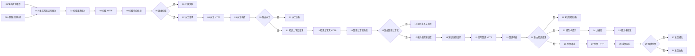

# 流程 01：预警派工与知识随单（V2 单输出）

## 流程信息

- 平台流程名称：`MoldGuard_01_预警派工与知识随单_V2`
- 节点数：33
- 预期连线数：38
- 输入示例：`开始检查`
- 系统运行批次：平台节点 01A/01B 拼接启动指令和北京时间，用户无需填写
- 扫描范围：Django 中全部非禁用模具（请求不传 `mold_ids`）
- 后端地址：`https://moldguard.oracle.19970219.xyz`
- 平台知识库：`模具保养知识库`
- 知识目录版本：`MOLDGUARD-KB-1.2`

## V2 设计原则

1. 所有 MoldGuard 单输出自定义节点都只有一个输出端口；画布上的请求/响应信封显示为 V3，HTTP/知识快照信封显示为 V2。
2. 请求信封输出单个 `Data`，包含 `method/url/json_body/context`。
3. `MoldGuard 单输入 HTTP V2` 执行信封中的请求，并原样传递 `context`。
4. 响应信封输出单个 `Message`，其 `data` 保留业务事实，文本包含 `[MOLDGUARD_OK]` 或 `[MOLDGUARD_FAIL]`。
5. 成功/失败必须使用平台原生“如果-否则”节点路由，不依赖自定义多输出。
6. Django 负责保养触发、自动派工和邮件；平台负责检索 `模具保养知识库` 和生成任务卡预览。
7. 当前时间和系统运行批次由平台画布生成；请求信封 V3 只消费上游批次，不在组件内部读取时间。

## 原生条件路由器统一配置

节点 05、10、15、21、29 都使用相同配置：

```text
输入文本 = 上游 V3 响应信封
操作符 = contains
匹配文本 = [MOLDGUARD_OK]
区分大小写 = true
消息 = 同一个上游 V3 响应信封
默认路由 = false_result
```

同一个响应信封的单输出同时连接条件节点的“输入文本”和“消息”。

### 五个路由节点的完整填写表

“文本输入”和“消息”都是连线端口，不是手工输入框。从对应的上游 `result` 输出圆点分别拖两次。

| 节点 | 文本输入 | 匹配文本 | 运算符 | 区分大小写 | 消息 | 真输出 | 假输出 |
|---|---|---|---|---|---|---|---|
| 05 路由扫描结果 | 连 `04.result` | 填 `[MOLDGUARD_OK]` | `contains` | 打开 | 再连一次 `04.result` | 连 `07.upstream` | 连 `06.input_value` |
| 10 路由派工结果 | 连 `09.result` | 填 `[MOLDGUARD_OK]` | `contains` | 打开 | 再连一次 `09.result` | 连 `12.upstream` | 连 `11.input_value` |
| 15 路由知识上下文 | 连 `14.result` | 填 `[MOLDGUARD_OK]` | `contains` | 打开 | 再连一次 `14.result` | 同时连 `17.search_query` 和 `18.upstream` | 连 `16.input_value` |
| 21 路由知识快照结果 | 连 `20.result` | 填 `[MOLDGUARD_OK]` | `contains` | 打开 | 再连一次 `20.result` | 同时连 `23.maintenance_context` 和 `26.upstream` | 连 `22.input_value` |
| 29 路由发信结果 | 连 `28.result` | 填 `[MOLDGUARD_OK]` | `contains` | 打开 | 再连一次 `28.result` | 连 `30.input_value` | 连 `31.input_value` |

五个节点的“最大迭代次数”保持 `10`，“默认路由”保持 `false_result`。

## 节点清单

| 编号 | 节点类型 | 节点名称 |
|---:|---|---|
| 01 | 聊天输入 | `01_输入检查指令` |
| 01A | 当前日期 | `01A_获取北京时间` |
| 01B | 提示词 | `01B_生成系统运行批次` |
| 02 | MoldGuard 请求信封 V3 | `02_构建扫描请求信封` |
| 03 | MoldGuard 单输入 HTTP V2 | `03_扫描并自动建单` |
| 04 | MoldGuard 响应信封 V3 | `04_验收扫描响应` |
| 05 | 如果-否则 | `05_路由扫描结果` |
| 06 | 聊天输出 | `06_展示未到期或扫描失败` |
| 07 | MoldGuard 请求信封 V3 | `07_构建自动派工请求` |
| 08 | MoldGuard 单输入 HTTP V2 | `08_自动派工` |
| 09 | MoldGuard 响应信封 V3 | `09_验收自动派工` |
| 10 | 如果-否则 | `10_路由派工结果` |
| 11 | 聊天输出 | `11_展示派工失败` |
| 12 | MoldGuard 请求信封 V3 | `12_构建知识上下文请求` |
| 13 | MoldGuard 单输入 HTTP V2 | `13_获取知识检索条件` |
| 14 | MoldGuard 响应信封 V3 | `14_验收知识上下文` |
| 15 | 如果-否则 | `15_路由知识上下文` |
| 16 | 聊天输出 | `16_展示知识上下文失败` |
| 17 | 我的知识库 | `17_检索模具保养知识` |
| 18 | MoldGuard 知识快照信封 V2 | `18_构建平台知识快照请求` |
| 19 | MoldGuard 单输入 HTTP V2 | `19_回写平台知识快照` |
| 20 | MoldGuard 响应信封 V3 | `20_验收知识快照` |
| 21 | 如果-否则 | `21_路由知识快照结果` |
| 22 | 聊天输出 | `22_展示知识快照失败` |
| 23 | 提示词 | `23_组装知识随单任务卡` |
| 24 | 大模型 | `24_生成知识随单任务卡` |
| 25 | 聊天输出 | `25_展示任务卡预览` |
| 26 | MoldGuard 请求信封 V3 | `26_构建Django发信请求` |
| 27 | MoldGuard 单输入 HTTP V2 | `27_请求Django发送邮件` |
| 28 | MoldGuard 响应信封 V3 | `28_验收发信响应` |
| 29 | 如果-否则 | `29_路由发信结果` |
| 30 | 聊天输出 | `30_展示发信成功` |
| 31 | 聊天输出 | `31_展示发信失败` |

## 节点图



## 画布端口对照

下表同时写画布中的中文显示名和代码内部名。后文连线以内部名为准，用中文名在画布上找端口。

| 节点类型 | 左侧输入端口 | 右侧输出端口 |
|---|---|---|
| 聊天输入 | 文本 `input_value` | 消息 `message` |
| 当前日期 | 时区 `timezone`（本组件实际固定为上海时区） | 当前日期 `current_date` |
| MoldGuard 请求信封 V3 | 演示批次 `demo_run_id` 或上游成功信封 `upstream` | 请求信封 `request` |
| MoldGuard 单输入 HTTP V2 | 请求信封 `request` | HTTP 响应信封 `response` |
| MoldGuard 响应信封 V3 | HTTP 响应信封 `response` | 业务响应信封 `result` |
| 如果-否则 | 文本输入 `input_text`，消息 `message` | 真 `true_result`，假 `false_result` |
| 聊天输出 | 文本 `input_value` | 消息 `message`（本流程不再往后连） |
| 我的知识库 | 搜索查询 `search_query` | 搜索结果 `search_results` |
| MoldGuard 知识快照信封 V2 | 知识上下文成功信封 `upstream`，知识库检索结果 `knowledge_results` | 知识快照请求信封 `request` |
| 提示词 | 保存模板后出现动态端口；节点 01B 为 `start_command/current_date`，节点 23 为 `maintenance_context` | 提示消息 `prompt` |
| 大模型 | 输入 `input_value` | 响应 `response` |

## 连线前必须先做

1. 在自定义组件中确认已保存四个单输出组件：`请求信封 V3`、`单输入 HTTP V2`、`响应信封 V3`、`知识快照信封 V2`。
2. 确认平台已有“当前日期”节点；其工作区源码为 `节点信息/当前日期.py`，输出端口是 `current_date`。
3. 把 33 个节点先放到画布上，并按“节点清单”重命名。
4. 每个“请求信封 V3”都要先选“请求类型”并保存，对应的 `demo_run_id` 或 `upstream` 输入口才会显示。
5. 先保存节点 01B 的批次模板，出现 `start_command/current_date` 后再连接；同理先保存节点 23 的模板，再连 `maintenance_context`。
6. 流程 01 不使用旧版 `MoldGuard 请求适配器`、`MoldGuard 响应适配器` 或原生 `JSON HTTP 请求`。如果 HTTP 节点还要求单独的 URL 和 Body，说明节点选错了。

## 逐节点配置与连接

### 第一段：入口至 06 扫描并自动建单

| 节点 | 固定配置 | 左侧输入 | 右侧输出去向 |
|---|---|---|---|
| 01 聊天输入 | 测试文本 `开始检查`；文件留空 | 无 | `message -> 01B.start_command` |
| 01A 当前日期 | 时区可留空；组件实际使用 `Asia/Shanghai` | 无 | `current_date -> 01B.current_date` |
| 01B 批次提示词 | 模板=`FLOW01-{start_command}-{current_date}`，保存后出现两个动态端口 | `start_command <- 01.message`；`current_date <- 01A.current_date` | `prompt -> 02.demo_run_id` |
| 02 扫描请求信封 | 请求类型=`扫描预警`；后端基础地址=`https://moldguard.oracle.19970219.xyz`；不显示模具 ID | `demo_run_id <- 01B.prompt` | `request -> 03.request` |
| 03 扫描 HTTP | 超时=`30`；跟随重定向=`true` | `request <- 02.request` | `response -> 04.response` |
| 04 扫描响应信封 | 响应类型=`扫描预警响应` | `response <- 03.response` | `result` 同时连到 `05.input_text` 和 `05.message` |
| 05 路由扫描结果 | 运算符=`contains`；匹配文本=`[MOLDGUARD_OK]`；区分大小写=`true`；默认路由=`false_result` | `input_text <- 04.result`；`message <- 04.result` | `false_result -> 06.input_value`；`true_result -> 07.upstream` |
| 06 扫描失败输出 | 保持聊天输出默认设置 | `input_value <- 05.false_result` | 无 |

节点 02 会构建 `POST /api/v1/alerts/scan`，请求体只有：

```json
{"client_request_id":"FLOW01-开始检查-当前时间是: 2026-08-14 15:30:45-scan"}
```

节点 01A 返回 `当前时间是: YYYY-MM-DD HH:MM:SS`。节点 01B 只是模板拼接，不调用大模型；它把启动指令和同一个北京时间组合成一次系统运行批次。节点 02 仅接收该值并写入 `context.demo_run_id`，供本次运行后续请求稳定复用，不会自行读取当前时间。

不得手工增加 `mold_ids`，也不得发送 `"mold_ids": null` 或 `"mold_ids": []`。完全省略该字段时，Django 才会扫描全部非禁用模具。不要在节点 03 里重复填 URL、请求方法或 JSON。

节点 04 会遍历全部 `results[]`，而不是只检查第 1 项。至少找到一个同时满足以下条件的结果时，才输出 `[MOLDGUARD_OK]`：

```text
HTTP 200
body.code = SUCCESS
results[].status = TRIGGERED
results[].code = MAINTENANCE_TRIGGERED
该结果的 work_order_id 和 alert_id 均非空
```

响应信封会把全部可派工的触发工单 ID 保存到 `context.triggered_work_order_ids`，并选择第一个有效触发工单继续当前单输出流程。若所有模具都未到保养阈值，或到期工单都已经派工、当前没有待派工项，会走 `05.false_result -> 06`，这是正常业务结果。

Django 会把已有工单但状态不再是 `PENDING_ASSIGNMENT` 的结果标记为 `SKIPPED + MAINTENANCE_WORK_ORDER_NOT_PENDING_ASSIGNMENT`。节点 04 无需修改，会跳过已经派工或正在处理的工单，并选择下一个待派工工单。需要处理多个到期工单时，每次都从节点 01 发起一次新的完整运行，并等待当前运行完成后再启动下一次；不要并发运行，也不要复用旧的系统运行批次。

### 第二段：07 至 11 Django 自动派工

| 节点 | 固定配置 | 左侧输入 | 右侧输出去向 |
|---|---|---|---|
| 07 派工请求信封 | 请求类型=`自动派工`；后端基础地址保持默认 | `upstream <- 05.true_result` | `request -> 08.request` |
| 08 自动派工 HTTP | 超时=`30`；跟随重定向=`true` | `request <- 07.request` | `response -> 09.response` |
| 09 派工响应信封 | 响应类型=`自动派工响应` | `response <- 08.response` | `result` 同时连到 `10.input_text` 和 `10.message` |
| 10 路由派工结果 | 匹配文本=`[MOLDGUARD_OK]`；运算符=`contains`；区分大小写=`打开`；默认路由=`false_result` | `input_text <- 09.result`；`message <- 09.result` | `false_result -> 11.input_value`；`true_result -> 12.upstream` |
| 11 派工失败输出 | 保持默认 | `input_value <- 10.false_result` | 无 |

`05.true_result` 传递的不是单独的工单 ID，而是完整 Message。节点 07 从 `Message.data.context.work_order_id` 取工单 ID，并生成：

```http
POST /api/v1/work-orders/{work_order_id}/auto-assign
```

节点 09 只在 Django 返回 `SUCCESS`、非空 `assignee_id` 和非空 `work_order_id` 时输出真分支标记。派工人员是 Django 根据技能、可用性等规则选出，不是 AI 选人。

### 第三段：12 至 16 生成知识库检索条件

| 节点 | 固定配置 | 左侧输入 | 右侧输出去向 |
|---|---|---|---|
| 12 知识上下文请求 | 请求类型=`知识上下文` | `upstream <- 10.true_result` | `request -> 13.request` |
| 13 知识上下文 HTTP | 超时=`30`；跟随重定向=`true` | `request <- 12.request` | `response -> 14.response` |
| 14 知识上下文响应 | 响应类型=`知识上下文响应` | `response <- 13.response` | `result` 同时连到 `15.input_text` 和 `15.message` |
| 15 路由知识上下文 | 匹配文本=`[MOLDGUARD_OK]`；运算符=`contains`；区分大小写=`打开`；默认路由=`false_result` | `input_text <- 14.result`；`message <- 14.result` | `false_result -> 16.input_value`；`true_result` 同时连 `17.search_query` 和 `18.upstream` |
| 16 知识上下文失败输出 | 保持默认 | `input_value <- 15.false_result` | 无 |

节点 12 会生成：

```http
GET /api/v1/work-orders/{work_order_id}/knowledge-context
```

节点 14 把 `mold_type`、`knowledge_profile_code`、`query_keywords[]` 和 `required_knowledge_types[]` 合并为搜索词。成功 Message 的第一行是搜索词，末尾带 `[MOLDGUARD_OK]`；同一 Message 的 `data.context` 保留工单和派工人员等业务字段。

### 第四段：17 至 22 平台检索并回写知识快照

| 节点 | 固定配置 | 左侧输入 | 右侧输出去向 |
|---|---|---|---|
| 17 我的知识库 | 知识库=`模具保养知识库`；结果数量=`4`；摄取数据留空 | `search_query <- 15.true_result` | `search_results -> 18.knowledge_results` |
| 18 知识快照请求 | 知识目录版本=`MOLDGUARD-KB-1.2`；后端基础地址保持默认；受控备用 JSON 默认留空 | `upstream <- 15.true_result`；`knowledge_results <- 17.search_results` | `request -> 19.request` |
| 19 回写知识 HTTP | 超时=`30`；跟随重定向=`true` | `request <- 18.request` | `response -> 20.response` |
| 20 知识快照响应 | 响应类型=`知识快照响应` | `response <- 19.response` | `result` 同时连到 `21.input_text` 和 `21.message` |
| 21 路由知识快照结果 | 匹配文本=`[MOLDGUARD_OK]`；运算符=`contains`；区分大小写=`打开`；默认路由=`false_result` | `input_text <- 20.result`；`message <- 20.result` | `false_result -> 22.input_value`；`true_result` 同时连 `23.maintenance_context` 和 `26.upstream` |
| 22 知识快照失败输出 | 保持默认 | `input_value <- 21.false_result` | 无 |

节点 18 有两条必要输入，不能只连其中一条：

```text
15.true_result -> 18.upstream             # 传工单、人员和系统运行批次
17.search_results -> 18.knowledge_results # 传平台知识库检索结果
```

节点 18 只接受字段完整的知识项：

```text
knowledge_id, title, item, knowledge_type, content, source, required
```

`required` 必须是 JSON 布尔值。真实检索没有有效条目时，才使用经人工确认的“受控备用知识项 JSON”；节点不会让 AI 猜测缺失字段。其生成的请求为：

```http
POST /api/v1/work-orders/{work_order_id}/knowledge
```

Django 会校验 `catalog_version`、规范化知识项、保存知识包并计算哈希。知识正文同时进入 `context.knowledge_text`，供节点 23 生成任务卡预览。

### 第五段：23 至 25 AI 任务卡预览

先在节点 23 粘贴以下模板并保存：

```text
{maintenance_context}

请生成一份简洁、明确的中文模具保养任务卡预览。

硬性要求：
1. 业务事实只能使用上游信封，不得修改或推算。
2. 保养、点检和安全要求只能引用平台检索知识。
3. 如果知识为空，写“未检索到可用知识”。
4. 提示员工通过邮件中的 Django 报工链接提交材料。
5. 这只是平台展示用任务卡，不得声称邮件已发送。
6. 只输出正文，不输出 JSON 或推理过程。
```

保存后配置和连线：

| 节点 | 固定配置 | 左侧输入 | 右侧输出去向 |
|---|---|---|---|
| 23 任务卡提示词 | 模板如上；实时资料入口留空 | `maintenance_context <- 21.true_result` | `prompt -> 24.input_value` |
| 24 大模型 | 选择已配置的模型；当前日期=`true`；显示推理过程=`false`；启用自动续写=`false`；工具留空 | `input_value <- 23.prompt` | `response -> 25.input_value` |
| 25 任务卡预览 | 保持默认 | `input_value <- 24.response` | 无 |

这一分支只用于展示，不影响 Django 中的工单、派工人或邮件。不要把 `24.response` 连到发信节点。

### 第六段：26 至 31 Django SMTP 发信

| 节点 | 固定配置 | 左侧输入 | 右侧输出去向 |
|---|---|---|---|
| 26 发信请求信封 | 请求类型=`发送派工邮件` | `upstream <- 21.true_result` | `request -> 27.request` |
| 27 Django 发信 HTTP | 超时=`30`；跟随重定向=`true` | `request <- 26.request` | `response -> 28.response` |
| 28 发信响应信封 | 响应类型=`派工邮件响应` | `response <- 27.response` | `result` 同时连到 `29.input_text` 和 `29.message` |
| 29 路由发信结果 | 匹配文本=`[MOLDGUARD_OK]`；运算符=`contains`；区分大小写=`打开`；默认路由=`false_result` | `input_text <- 28.result`；`message <- 28.result` | `true_result -> 30.input_value`；`false_result -> 31.input_value` |
| 30 发信成功输出 | 保持默认 | `input_value <- 29.true_result` | 无 |
| 31 发信失败输出 | 保持默认 | `input_value <- 29.false_result` | 无 |

节点 26 从 `21.true_result.data.context` 取得工单 ID 和系统生成的运行批次，生成：

```http
POST /api/v1/work-orders/{work_order_id}/send-email
```

请求体只有：

```json
{"client_request_id":"<01B生成的同一系统运行批次>-send-email"}
```

平台不传邮箱、主题、正文或 AI 输出。Django 根据最终派工人和已保存知识快照渲染邮件，并用 SMTP 发送。节点 28 只有同时收到 `new_email_status=SENT` 和非空 `email_message_id` 才判定成功。

## 38 条逐线连接表

| # | 从：节点.输出端口 | 到：节点.输入端口 | 这条线传什么 |
|---:|---|---|---|
| 1 | `01.message`（消息） | `01B.start_command`（动态端口） | 用户输入的“开始检查”等短指令 |
| 2 | `01A.current_date`（当前日期） | `01B.current_date`（动态端口） | 上海时区当前日期和时间 |
| 3 | `01B.prompt`（提示消息） | `02.demo_run_id`（演示批次） | 指令和时间拼成的稳定系统运行批次 |
| 4 | `02.request`（请求信封） | `03.request`（请求信封） | 扫描的方法、URL、Body 和初始 context |
| 5 | `03.response`（HTTP 响应信封） | `04.response`（HTTP 响应信封） | 扫描 HTTP 状态、Body 和 context |
| 6 | `04.result`（业务响应信封） | `05.input_text`（文本输入） | 让条件节点查找 `[MOLDGUARD_OK]` |
| 7 | `04.result`（业务响应信封） | `05.message`（消息） | 让条件节点原样传递完整 Message.data |
| 8 | `05.false_result`（假） | `06.input_value`（文本） | 展示未到期、校验失败或 HTTP 失败 |
| 9 | `05.true_result`（真） | `07.upstream`（上游成功信封） | 将工单 ID 和系统运行批次传给派工请求 |
| 10 | `07.request` | `08.request` | 自动派工请求信封 |
| 11 | `08.response` | `09.response` | 自动派工 HTTP 响应信封 |
| 12 | `09.result` | `10.input_text` | 判断派工响应是否含成功标记 |
| 13 | `09.result` | `10.message` | 在真/假分支中传递派工 Message.data |
| 14 | `10.false_result` | `11.input_value` | 展示派工失败原因 |
| 15 | `10.true_result` | `12.upstream` | 将工单和 `employee_id` 传给知识上下文请求 |
| 16 | `12.request` | `13.request` | 知识上下文 GET 请求信封 |
| 17 | `13.response` | `14.response` | 知识上下文 HTTP 响应信封 |
| 18 | `14.result` | `15.input_text` | 判断知识上下文是否成功 |
| 19 | `14.result` | `15.message` | 传递搜索词与完整 context |
| 20 | `15.false_result` | `16.input_value` | 展示知识上下文失败 |
| 21 | `15.true_result` | `17.search_query` | 把生成的模具保养搜索词传给平台知识库 |
| 22 | `15.true_result` | `18.upstream` | 把工单、派工人、系统运行批次传给知识快照信封 |
| 23 | `17.search_results` | `18.knowledge_results` | 把知识库返回的 `list[Data]` 传给快照校验器 |
| 24 | `18.request` | `19.request` | 知识快照 POST 请求信封 |
| 25 | `19.response` | `20.response` | 知识回写 HTTP 响应信封 |
| 26 | `20.result` | `21.input_text` | 判断知识快照是否保存成功 |
| 27 | `20.result` | `21.message` | 传递已保存知识文本与完整 context |
| 28 | `21.false_result` | `22.input_value` | 展示知识快照回写失败 |
| 29 | `21.true_result` | `23.maintenance_context` | 把工单、人员和检索知识交给 AI 任务卡模板 |
| 30 | `23.prompt` | `24.input_value` | 组装好的任务卡提示消息 |
| 31 | `24.response` | `25.input_value` | AI 任务卡预览正文 |
| 32 | `21.true_result` | `26.upstream` | 在知识快照成功后独立启动 Django 发信分支 |
| 33 | `26.request` | `27.request` | Django 发信 POST 请求信封 |
| 34 | `27.response` | `28.response` | Django 发信 HTTP 响应信封 |
| 35 | `28.result` | `29.input_text` | 判断是否真实返回 `SENT + email_message_id` |
| 36 | `28.result` | `29.message` | 在发信真/假分支中传递完整响应 |
| 37 | `29.true_result` | `30.input_value` | 展示 Django 真实发信成功 |
| 38 | `29.false_result` | `31.input_value` | 展示发信失败或响应字段不完整 |

## 一拖二位置总结

本流程有 7 个必须从同一输出端口再拉一条线的位置：

```text
04.result -> 05.input_text + 05.message
09.result -> 10.input_text + 10.message
14.result -> 15.input_text + 15.message
15.true_result -> 17.search_query + 18.upstream
20.result -> 21.input_text + 21.message
21.true_result -> 23.maintenance_context + 26.upstream
28.result -> 29.input_text + 29.message
```

操作时从源节点的同一圆点分别拖两次。不要为此复制自定义节点。“如果-否则”是平台原生节点，它的真/假端口可正常使用；受单输出限制的是新建自定义节点。

## `context` 自动携带的数据

后续节点不再单独连 `work_order_id`、`employee_id` 等字段，因为 V2 信封会在 `Message.data.context` 中累积传递：

| 通过哪个响应节点后 | `context` 新增/保留的关键字段 |
|---|---|
| 04 扫描响应 | `demo_run_id`（节点 01B 生成）、`scan_scope`、`scanned_count`、`triggered_count`、`triggered_work_order_ids`、`selected_mold_id`、`work_order_id`、`alert_id`、`status`、`scan_code` |
| 09 派工响应 | 上述字段 + `employee_id` |
| 14 知识上下文 | 上述字段 + `mold_type`、`knowledge_profile_code`、`search_query`、`query_keywords`、`required_knowledge_types` |
| 18 知识快照请求 | 上述字段 + `knowledge_text`、`knowledge_items`、`knowledge_source`、`catalog_version` |
| 20 知识快照响应 | 原样保留节点 18 的 context，再加 Django 回写结果 |
| 28 发信响应 | 上述字段 + `email_status`、`message_id`、`sent_at`、`replayed` |

原生条件节点的 `message` 输入和真/假输出传递的是同一个 Message，所以只要“文本输入”和“消息”两条线都连了，`context` 不会在分支处丢失。

## 常见连接错误

| 现象 | 原因 | 处理 |
|---|---|---|
| 批次提示词没有 `start_command` 或 `current_date` 端口 | 节点 01B 的模板尚未保存，或占位符拼写不一致 | 模板填 `FLOW01-{start_command}-{current_date}` 并保存，再连接节点 01 和 01A |
| 请求信封没有 `upstream` 端口 | 还没选请求类型，或选后未保存 | 先选 `自动派工` / `知识上下文` / `发送派工邮件`，再保存节点 |
| HTTP 节点要求单独连 URL 和 Body | 用成了原生 `JSON HTTP 请求` | 换成 `MoldGuard 单输入 HTTP V2` |
| 条件节点能判断，但后续节点说 context 为空 | 只连了 `input_text`，没连 `message` | 从同一 `result` 再拉一条线到条件节点的“消息” |
| 所有结果都走假分支 | 运算符或匹配文本填错 | 设为 `contains`，匹配文本必须是完整的 `[MOLDGUARD_OK]` |
| 知识快照节点报“检索结果不是 Data” | 连了知识库节点本身或错输出 | 必须连 `17.search_results -> 18.knowledge_results` |
| 知识快照节点报缺少字段 | 知识库条目 metadata 不完整 | 补齐知识库 metadata，或填写经确认的受控备用 JSON，不要用 AI 自由文本 |
| 提示词没有 `maintenance_context` 端口 | 模板尚未保存 | 先粘贴包含 `{maintenance_context}` 的模板并保存 |
| 发信必须等 AI 返回才执行 | 把节点 26 错连到了 24/25 | 节点 26 只能连 `21.true_result`，AI 预览和 Django 发信是两个并行分支 |
| 自定义节点仍显示多个可选输出 | 使用了旧版组件 | 请求/响应信封应显示 V3；HTTP/知识快照信封应显示 V2；四者都只有一个右侧输出端口 |

## 运行顺序与现场检查

1. 先只运行至节点 06，确认授权的演示模具能返回 `TRIGGERED + MAINTENANCE_TRIGGERED`。
2. 接上 07 至 11，确认节点 09 的 `context.employee_id` 非空。
3. 接上 12 至 22，在节点 17 直接查看检索结果，再确认节点 20 返回 `HTTP 200 + SUCCESS`。
4. 接上 23 至 25，检查 AI 任务卡只引用平台检索到的保养知识。
5. 最后接上 26 至 31。这一段会触发真实 SMTP 发信，只能在演示数据可用、收件人是授权测试邮箱时运行。

调试时可以暂时不接 26～31，但正式验收前必须恢复。不要在未授权的情况下重置远程演示数据。

## 验收

1. 四个单输出自定义组件都只显示一个输出端口；请求/响应信封显示 V3，HTTP/知识快照信封显示 V2。
2. 33 个节点和 38 条连线均已完成；7 个一拖二位置与本文一致。
3. 五个“如果-否则”节点都同时连了 `input_text` 和 `message`。
4. 用户只需输入“开始检查”等指令；节点 01A/01B 生成稳定系统运行批次，节点 02 只追加 `-scan`，请求体不含 `mold_ids`，Django 返回全部非禁用模具的扫描结果。
5. 节点 04 遍历全部 `results[]`，并选中一个 `TRIGGERED + MAINTENANCE_TRIGGERED` 且工单/预警 ID 非空的结果。
6. 自动派工返回非空 `assignee_id`，且 AI 未参与选人。
7. 平台 `模具保养知识库` 真实检索，知识快照回写返回 `SUCCESS`。
8. AI 任务卡只引用信封中的平台检索知识，不作业务裁决。
9. Django 发信返回 `new_email_status=SENT`、非空 `email_message_id` 和 `email_sent_at`。
10. 只有在授权的演示数据和测试收件箱确认后才点击完整运行。
