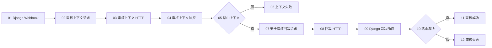

# 流程 02：Django 报工 AI 审核（V2 单输出）

## 流程信息

- 平台流程名称：`MoldGuard_02_Django报工AI审核_V2`
- 当前安全版节点数：12
- 预期连线数：13
- 入口：Django 调用平台外部触发器 Webhook
- 后端地址：`https://moldguard.oracle.19970219.xyz`
- 员工入口：邮件中的 Django `report_url`
- 自定义节点源码：`../比赛平台_自定义节点/`

本流程不接收员工直接报工。员工文字和图片先由 Django 页面保存，平台只接收定位事件，再回读 Django 审核上下文。

## V2 设计原则

1. 所有 MoldGuard V2 自定义节点都只有一个输出端口。
2. `MoldGuard 请求信封 V2` 输出单个 `Data`，包含 `method/url/json_body/context`。
3. `MoldGuard 单输入 HTTP V2` 执行信封中的 HTTP 请求，并原样传递 `context`。
4. `MoldGuard 响应信封 V2` 输出单个 `Message`，文本包含 `[MOLDGUARD_OK]` 或 `[MOLDGUARD_FAIL]`。
5. 成功/失败必须使用平台原生“如果-否则”节点路由，不依赖自定义多输出。
6. Django 保存原始报工材料并作最终裁决；平台只读取上下文和回写建议。

## 当前能力结论

已确认的平台“大模型”节点只消费文本，不能证明它读取了图片真实像素。因此当前 12 节点版本是安全门禁流程：它验证 Webhook、上下文和回写链路，但只回写 `NEEDS_MORE_INFO`，绝不回写 `COMPLETE` 或 `ABNORMAL`。

## 原生条件路由器统一配置

节点 05 和 10 使用相同配置：

```text
输入文本 = 上游 V2 响应信封
操作符 = contains
匹配文本 = [MOLDGUARD_OK]
区分大小写 = true
消息 = 同一个上游 V2 响应信封
默认路由 = false_result
```

同一个响应信封的单输出同时连接条件节点的“输入文本”和“消息”。

## 节点清单

| 编号 | 节点类型 | 节点名称 |
|---:|---|---|
| 01 | 外部触发器(Webhook) | `01_接收Django报工唤醒` |
| 02 | MoldGuard 请求信封 V2 | `02_构建审核上下文请求` |
| 03 | MoldGuard 单输入 HTTP V2 | `03_读取报工审核上下文` |
| 04 | MoldGuard 响应信封 V2 | `04_验收审核上下文` |
| 05 | 如果-否则 | `05_路由审核上下文` |
| 06 | 聊天输出 | `06_展示上下文失败` |
| 07 | MoldGuard 请求信封 V2 | `07_构建安全审核回写请求` |
| 08 | MoldGuard 单输入 HTTP V2 | `08_回写审核建议` |
| 09 | MoldGuard 响应信封 V2 | `09_验收Django裁决` |
| 10 | 如果-否则 | `10_路由Django裁决` |
| 11 | 聊天输出 | `11_展示审核成功` |
| 12 | 聊天输出 | `12_展示审核失败` |

## 节点图



## 关键节点配置

### 01 接收 Django 唤醒

保存平台生成的 Webhook endpoint，并把它配置到 Django：

```text
MOLDGUARD_REPORT_REVIEW_WEBHOOK_URL=<平台生成的endpoint>
```

Django 发送的负载只包含定位字段：

```json
{
  "event": "REPORT_SUBMISSION_READY",
  "submission_id": "RPT-20260814-ABC123",
  "work_order_id": "WO-20260814-001",
  "review_context_url": "https://moldguard.oracle.19970219.xyz/api/v1/report-submissions/RPT-20260814-ABC123/review-context",
  "client_request_id": "review-dispatch-RPT-20260814-ABC123"
}
```

负载中不得出现员工正文、图片字节、SMTP 信息或任何凭据。

### 02 审核上下文请求信封

- 请求类型：`报工审核上下文`
- `source_data <- 01.data`
- 后端基础地址：保持默认值

节点从 Webhook `submission_id` 构建：

```http
GET /api/v1/report-submissions/{submission_id}/review-context
```

### 03 读取审核上下文

- `request <- 02.request`
- 不再手工连接 URL 或 JSON Body
- 请求方法由信封中的 `method=GET` 决定

响应必须包含员工文字、全部证据 URL、工单、模具、被派工人、锁定知识包和回写 URL。

### 04 验收审核上下文

- 响应类型：`报工审核上下文响应`
- `response <- 03.response`

成功条件：

```text
HTTP 200
body.code = SUCCESS
submission_id 非空
evidence 至少 1 张
knowledge_package_hash 非空
```

成功后，响应信封会把 `submission_id`、`work_order_id`、`knowledge_package_hash` 和首张证据 URL 写入 `Message.data.context`。

### 05、06 上下文路由

- `04.result` 同时连接 `05.input_text` 和 `05.message`
- `05.false_result -> 06.input_value`
- `05.true_result -> 07.upstream`

只有 `[MOLDGUARD_OK]` 真分支可以构建回写请求。

### 07 构建安全审核回写请求

- 请求类型：`报工审核回写`
- `upstream <- 05.true_result`
- `AI 审核 JSON（可选）`：当前留空

当可选输入留空时，节点从上游 `context` 取得 `submission_id` 和 `knowledge_package_hash`，并生成固定的安全门禁请求：

```json
{
  "client_request_id": "review-<submission_id>-safe-001",
  "decision": "NEEDS_MORE_INFO",
  "assessment_summary": "当前平台尚未验证图片可进入多模态模型，无法形成完成或异常建议。",
  "confidence": 0.0,
  "knowledge_package_hash": "<上下文中的锁定知识包哈希>",
  "inspection_results": [],
  "abnormal_items": [],
  "abnormal_next_action": null,
  "reason_codes": ["MULTIMODAL_INPUT_NOT_VERIFIED"],
  "knowledge_sources": ["MOLDGUARD-KB-1.2"],
  "review_model": "SAFE_GATE_NO_VISION"
}
```

`MULTIMODAL_REVIEW_VERIFIED=False` 会再次强制检查 `decision`。任何 `COMPLETE` 或 `ABNORMAL` 都会在请求发送前被阻止。

### 08 回写审核建议

- `request <- 07.request`
- 不再手工连接 URL 或 JSON Body
- 请求方法由信封中的 `method=POST` 决定

请求目标：

```http
POST /api/v1/report-submissions/{submission_id}/review
```

### 09 验收 Django 裁决

- 响应类型：`报工审核回写响应`
- `response <- 08.response`

当前安全版应返回：

```text
HTTP 200
body.code = SUCCESS
body.data.submission_id 非空
body.data.submission_status = NEEDS_MORE_INFO
工单状态保持 ASSIGNED / IN_PROGRESS / PAUSED
```

### 10、11、12 裁决路由

- `09.result` 同时连接 `10.input_text` 和 `10.message`
- `10.true_result -> 11.input_value`
- `10.false_result -> 12.input_value`

成功输出展示提交 ID、报工提交状态、工单状态和 Django 裁决摘要；失败输出保留 HTTP 与业务校验失败原因。

## 13 条连线清单

```text
01.data -> 02.source_data
02.request -> 03.request
03.response -> 04.response
04.result -> 05.input_text
04.result -> 05.message
05.false_result -> 06.input_value
05.true_result -> 07.upstream
07.request -> 08.request
08.response -> 09.response
09.result -> 10.input_text
09.result -> 10.message
10.true_result -> 11.input_value
10.false_result -> 12.input_value
```

## 启用完整多模态审核的门槛

以下条件全部满足后，才能在节点 07 的“AI 审核 JSON”输入前增加真实多模态审核链，并把 `MULTIMODAL_REVIEW_VERIFIED` 改为 `True`：

1. 实测节点能读取 `submission.evidence[]` 中全部图片的真实像素，而不只是 URL 文本或文件名。
2. AI 同时使用 `submission.report_text`、锁定的 `knowledge_package` 和全部图片。
3. 输出严格 JSON，决策仅为 `COMPLETE`、`ABNORMAL` 或 `NEEDS_MORE_INFO`。
4. `COMPLETE` 提供全部必检项结论且无 `FAIL`；`ABNORMAL` 提供 `FAIL` 或异常项目及后续动作。
5. 使用测试图片证明“图片内容变化会改变审核结论”，并保存平台执行证据。
6. 重新运行自定义节点测试和 Django 报工审核测试。

即使门槛通过，AI 仍然只给建议。Django 会再次校验知识哈希、置信度、点检完整性、工单状态和异常组合，只有 Django 可以完成工单、复位周期、创建履历或关闭告警。

## 验收清单

```text
[ ] 流程 02 中的 V2 自定义节点都只有一个输出端口
[ ] 员工只从 Django report_url 上传文字和图片
[ ] Webhook 不含员工正文和图片
[ ] 平台能 GET 审核上下文及全部证据 URL
[ ] 上下文失败时不会构建或发送回写请求
[ ] 当前组件拒绝 COMPLETE 和 ABNORMAL
[ ] 安全版回写 NEEDS_MORE_INFO
[ ] Django 工单状态不变
[ ] 员工重新打开原链接可看到补充原因并提交新材料
[ ] 不存在平台报工提交 API 或流程
```
