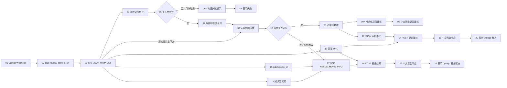

# 流程 02：Django 报工豆包多模态 AI 审核

## 流程信息

- 平台智能体名称：`MoldGuard_Django报工AI审核`
- 平台画布名称：`MoldGuard_02_Django报工AI审核`
- 平台流程 ID：`d572e00b-1294-47b9-ad9c-2155dec33998`
- Webhook：`https://zhgh.xiaotian.ai/api/v1/webhook/d572e00b-1294-47b9-ad9c-2155dec33998`
- 当前可见节点数：26
- 已连接业务节点数：24
- 当前连线数：30
- 后端地址：`https://moldguard.oracle.19970219.xyz`
- 员工入口：邮件中的 Django `report_url`
- 平台实装核对日期：`2026-08-15`

员工只在 Django 页面提交文字和 1 至 10 张图片。平台不提供员工报工页面，也不从聊天输入接收正式报工。

当前画布另外保留 2 个未连线的旧“模板数据注入”节点，所以可见节点数为 26；真正参与执行的仍是下文 24 个节点和 30 条连线。

## 最终实现口径

流程 02 只使用一个已经审核的自定义节点：

```text
MoldGuard 豆包多模态 V1（批量图片）
```

其余全部使用平台原生节点：

```text
外部触发器(Webhook)
解析器
JSON HTTP 请求
如果-否则
提示词
聊天输出
消息转数据
模板数据注入
```

流程 01 已使用的 `MoldGuard 请求信封 V3` 和 `MoldGuard 响应信封 V3` 保持原样。流程 02 不使用它们，也不需要 V4。

不要使用原生 `API请求` 节点做本流程 POST。该节点接收连接进来的 `Data` 正文时可能静默变成 `{}`；本流程统一使用原生 `JSON HTTP 请求`，其输出结构固定为：

```json
{
  "status_code": 200,
  "headers": {},
  "body": {
    "code": "SUCCESS",
    "message": "...",
    "data": {},
    "request_id": "..."
  }
}
```

## 权责边界

```text
Django：保存员工文字和图片，提供锁定知识包，校验哈希、字段、置信度和状态并最终落库
提示词：定义审核规则、中文表达和 Django POST JSON 契约
豆包：读取员工文字、锁定知识包和全部图片，形成审核建议
平台原生节点：GET 上下文、路由、POST 建议并显示 Django 响应
```

Django 是完工、异常、周期复位和履历的唯一权威。模型不得覆盖员工、工单、派工人或报工类型；即使模型返回合法 JSON，Django 仍会拒绝错误知识哈希、非法枚举、低置信度和不符合状态机的结果。

## 节点清单

| 编号 | 节点类型 | 节点名称 |
|---:|---|---|
| 01 | 外部触发器(Webhook) | `01_接收Django报工唤醒` |
| 02 | 解析器 | `02_提取审核上下文URL` |
| 03 | JSON HTTP 请求 | `03_GET报工审核上下文` |
| 04 | 解析器 | `04_审核上下文字符串化` |
| 05 | 如果-否则 | `05_校验审核上下文` |
| 06A | 模板数据注入 | `06A_构建上下文失败提示` |
| 06 | 聊天输出 | `06_展示上下文失败` |
| 07 | 提示词 | `07_配置报工审核规则` |
| 08 | MoldGuard 豆包多模态 V1 | `08_豆包批量图片审核` |
| 09A | 解析器 | `09A_格式化豆包审核建议` |
| 09 | 聊天输出 | `09_展示豆包审核建议` |
| 10 | 如果-否则 | `10_豆包结果安全门` |
| 11 | 消息转数据 | `11_提取豆包审核JSON` |
| 12 | 解析器 | `12_豆包JSON字符串化` |
| 13 | 解析器 | `13_提取审核回写URL` |
| 14 | JSON HTTP 请求 | `14_POST豆包审核建议` |
| 15 | 解析器 | `15_提取报工提交ID` |
| 16 | 解析器 | `16_提取知识包哈希` |
| 17 | 模板数据注入 | `17_构建安全补充回写` |
| 18 | JSON HTTP 请求 | `18_POST安全补充结果` |
| 19 | 解析器 | `19_中文化豆包回写响应` |
| 20 | 聊天输出 | `20_展示Django豆包裁决` |
| 21 | 解析器 | `21_中文化安全回写响应` |
| 22 | 聊天输出 | `22_展示Django安全裁决` |

### 当前画布的两个未连线节点

平台只读核对时还存在以下两个原生节点。它们没有任何输入或输出连线，不参与流程执行，且显示名与已连接的 19、21 解析器重复：

| 节点类型 | 平台当前显示名 | 当前状态 |
|---|---|---|
| 模板数据注入 | `19_中文化豆包回写响应` | 未连线；模板仍为默认占位内容 |
| 模板数据注入 | `21_中文化安全回写响应` | 未连线；模板仍为默认占位内容 |

因此本文后续流程图和 30 条连线表只描述 24 个已连接节点。若以后清理这两个原生遗留节点，不涉及自定义组件复审；清理前先导出画布备份，并同步把“当前可见节点数”从 26 改为 24。

## 流程图



节点 10 先检查豆包结果中的机器门禁标记。只有通过门禁的严格 JSON 才经节点 11 和 09A 转成不含机器标记的用户摘要，并同时进入 Django 回写；未通过门禁的结果只进入固定 `NEEDS_MORE_INFO` 分支。两条 POST 分支都使用 Django 返回的可信回写 URL，并把 Django 裁决整理成中文说明显示给用户。

## 节点配置

### 01 接收 Django 唤醒

Oracle 环境变量保持：

```text
MOLDGUARD_REPORT_REVIEW_WEBHOOK_URL=https://zhgh.xiaotian.ai/api/v1/webhook/d572e00b-1294-47b9-ad9c-2155dec33998
```

Django Webhook 只发送定位字段：

```json
{
  "event": "REPORT_SUBMISSION_READY",
  "submission_id": "RPT-20260814-ABC123",
  "work_order_id": "WO-20260814-001",
  "review_context_url": "https://moldguard.oracle.19970219.xyz/api/v1/report-submissions/RPT-20260814-ABC123/review-context",
  "client_request_id": "review-dispatch-RPT-20260814-ABC123"
}
```

Webhook 不得包含员工正文、图片字节、SMTP 信息或凭据。输出端口的真实名称是 `output_data`。

### 02 提取审核上下文 URL

```text
模式 = 整理模式 (Parser)
模板 = {review_context_url}
数据源 <- 01.output_data
```

### 03 GET 报工审核上下文

```text
URL <- 02.parsed_text
HTTP 方法 = GET
请求体 = 留空
自定义请求头 = 留空
超时 = 30
跟随重定向 = 打开
```

响应必须包含 `body.data.submission`、全部 `evidence[]`、`work_order`、锁定的 `knowledge_package`、64 位 `knowledge_package_hash` 和 `review_callback_url`。

### 04、05、06A、06 上下文字符串化和校验

节点 04：

```text
模式 = 原文模式 (Stringify)
数据源 <- 03.response
```

节点 05：

```text
文本输入 <- 04.parsed_text
消息 <- 04.parsed_text
运算符 = regex
匹配文本 = (?s)(?=.*"status_code"\s*:\s*200)(?=.*"code"\s*:\s*"SUCCESS")(?=.*"submission_id"\s*:\s*"[^"]+")(?=.*"evidence"\s*:\s*\[\s*\{)(?=.*"knowledge_package_hash"\s*:\s*"[0-9a-fA-F]{64}")(?=.*"review_callback_url"\s*:\s*"https://).*
默认路由 = false_result
```

节点 06A 使用原生“模板数据注入”，模板固定为：

```text
报工审核未开始

系统未能取得完整的报工材料，本次未调用图片审核，也未修改工单状态。
请检查报工信息和现场图片后重新提交。
```

连接：

```text
05.false_result -> 06A.tool_placeholder
06A.text -> 06.input_value
```

`tool_placeholder` 只负责在校验失败分支触发节点 06A，不写入展示文本。这样节点 06 不会展示原始 HTTP 响应或审核上下文。`05.true_result` 只把已校验的完整 JSON Message 交给节点 07 作为可信提示词上下文；豆包图片来源始终使用节点 03 的原始响应 Data。

### 07 审核提示词

平台原生“提示词”节点只保留动态变量 `{review_context}`，连接 `05.true_result -> 07.review_context`。

建议模板：

```text
你是模具保养报工审核员。请依据 Django 提供的可信审核上下文、锁定知识包，以及本条模型消息后附带的全部现场图片进行判断。

Django 审核上下文：
{review_context}

审核要求：
1. 必须逐张读取消息中的全部图片真实内容，不得只根据 URL、文件名或员工文字判断。
2. 同时核对 body.data.submission.report_text、actual_work_hours、parts_replaced、body.data.work_order 和 body.data.knowledge_package。
3. 对 knowledge_package.items 中的每个必检项给出 PASS、FAIL 或 NOT_APPLICABLE；无法确认时不得猜测。
4. 全部必检项有充分证据且无 FAIL 时才可输出 COMPLETE。
5. 有明确 FAIL 或异常项时输出 ABNORMAL，并给出 CONTINUE_PROCESSING 或 CREATE_REPAIR_TASK。
6. 图片无法读取、不清晰、材料不足或置信度不足时输出 NEEDS_MORE_INFO。
7. COMPLETE 或 ABNORMAL 的 confidence 必须至少为 0.7500；confidence 最多保留四位小数。
8. assessment_summary 必须使用中文，并按“图片1、图片2……”写明观察；需要补充材料时也写入该字段。
9. client_request_id 必须严格等于字符串 ai-review- 加 body.data.submission.submission_id。
10. knowledge_package_hash 必须原样复制 body.data.knowledge_package_hash，不得自行生成。
11. 只输出一个合法 JSON 对象，不要输出 Markdown、代码围栏、前言或结尾。
12. 不得输出 employee_id、assignee_id、work_order_id 或 report_type。

顶层 JSON 只能包含以下键，不得增加展示专用键：
- client_request_id：字符串
- decision：COMPLETE、ABNORMAL 或 NEEDS_MORE_INFO
- assessment_summary：中文字符串
- confidence：0 至 1 的数字
- knowledge_package_hash：64 位字符串
- inspection_results：数组；每项包含 knowledge_id、result、not_applicable_reason、abnormal_note
- abnormal_items：数组；每项包含 item、description
- abnormal_next_action：CONTINUE_PROCESSING、CREATE_REPAIR_TASK 或 null
- reason_codes：英文机器原因码数组
- knowledge_sources：知识来源数组
- review_model：实际使用的模型名称

COMPLETE 不得包含 FAIL、abnormal_items 或 abnormal_next_action。
ABNORMAL 必须至少包含一个 FAIL 或 abnormal_items，并必须填写 abnormal_next_action。
NEEDS_MORE_INFO 可以使用空 inspection_results，abnormal_next_action 必须为 null。
```

审核规则全部在这个提示词中，不写死在豆包自定义节点里。

### 08 豆包批量图片审核

从平台已审核组件库选择 `MoldGuard 豆包多模态 V1（批量图片）`，不要重新粘贴、修改或注册组件源码，然后按以下方式连接：

```text
外部提示词 <- 07.prompt
图片来源 <- 03.response
图片字段路径 = body.data.submission.evidence
允许的图片域名 = moldguard.oracle.19970219.xyz
输出模式 = 严格 JSON
图片细节 = high
最大图片数 = 10
模型名称 = 选择平台豆包中明确支持视觉输入的模型
API Key = 留空，复用平台全局 bytedance Key
```

节点直接从节点 03 的原始 HTTP 响应 Data 中读取 `body.data.submission.evidence`，并把每张图片构造成独立的 `image_url` 内容块。不要把 `05.true_result` 接到图片来源：条件路由输出的是 Message，可能优先携带不含 `body.data.submission.evidence` 的消息数据，从而触发“图片来源中不存在字段路径”的安全回退。节点 07 的提示词仍由 `05.true_result` 触发，因此审核上下文校验失败时不会调用豆包。成功时 `Message.data` 是模型 JSON；失败时输出 `[DOUBAO_FAIL]` 和空数据。

### 09A、09 展示豆包建议

```text
模式 = 整理模式 (Parser)
数据源 <- 11.data

模板：
AI 图片审核建议

审核结论：{decision}
审核说明：{assessment_summary}
置信度：{confidence}

代码说明：COMPLETE=审核完成；ABNORMAL=发现异常；NEEDS_MORE_INFO=需要补充材料。
```

连接：

```text
11.data -> 09A.input_data
09A.parsed_text -> 09.input_value
```

节点 09 只展示门禁通过后的中文审核摘要，不再直接接收节点 08 的 Message，因此不会暴露 `[DOUBAO_OK]`、`[DOUBAO_DECISION=...]` 或“机器审核结果已准备”等内部控制文本。这是豆包建议，不是 Django 最终状态；Django 裁决仍在节点 20 或 22 展示。

### 10 豆包结果安全门

首次注册和像素对照测试期间使用：

```text
文本输入 <- 08.result
消息 <- 08.result
运算符 = regex
匹配文本 = (?s)(?=.*\[DOUBAO_OK\])(?=.*\[DOUBAO_DECISION=NEEDS_MORE_INFO\]).*
默认路由 = false_result
```

豆包节点会根据严格 JSON 的 `decision` 生成独立机器标记，例如
`[DOUBAO_DECISION=NEEDS_MORE_INFO]`。这条规则只匹配该标记，不会因中文审核说明偶然提到
`NEEDS_MORE_INFO` 而误放行。模型提前给出 `COMPLETE` / `ABNORMAL`、模型异常或 JSON 无效时，统一从 `false_result` 进入节点 17 的固定安全回写。

完成真实图片像素对照测试后，只改节点 10：

```text
运算符 = contains
匹配文本 = [DOUBAO_OK]
区分大小写 = 打开
```

不要修改豆包节点代码、V3 请求信封或 V3 响应信封来开门。

### 11、12 豆包 JSON 转 POST 正文

节点 11：

```text
消息 <- 10.true_result
```

原生“消息转数据”只复制 `Message.data`。豆包成功时这里得到严格 JSON 对象；`11.data` 同时供节点 09A 生成人类可读摘要，并供节点 12 生成 Django POST 正文。

节点 12：

```text
模式 = 原文模式 (Stringify)
数据源 <- 11.data
```

`12.parsed_text` 是可直接连接 `JSON HTTP 请求.json_body` 的合法 JSON 字符串。

### 13 提取回写 URL

```text
模式 = 整理模式 (Parser)
模板 = {body[data][review_callback_url]}
数据源 <- 03.response
```

### 14 POST 豆包建议

```text
URL <- 13.parsed_text
HTTP 方法 = POST
请求体 <- 12.parsed_text
自定义请求头 = 留空
超时 = 30
跟随重定向 = 打开
```

### 15、16 提取安全回写字段

节点 15：

```text
模式 = 整理模式 (Parser)
模板 = {body[data][submission][submission_id]}
数据源 <- 03.response
```

节点 16：

```text
模式 = 整理模式 (Parser)
模板 = {body[data][knowledge_package_hash]}
数据源 <- 03.response
```

### 17 构建固定安全回写

平台原生“模板数据注入”节点使用下面的 JSON 模板：

```json
{
  "client_request_id": "ai-review-{submission_id}",
  "decision": "NEEDS_MORE_INFO",
  "assessment_summary": "暂时无法完成图片审核，请补充清晰、完整的现场图片后重新提交。",
  "confidence": 0,
  "knowledge_package_hash": "{knowledge_package_hash}",
  "inspection_results": [],
  "abnormal_items": [],
  "abnormal_next_action": null,
  "reason_codes": ["AI_MULTIMODAL_SAFE_FALLBACK"],
  "knowledge_sources": [],
  "review_model": "doubao-multimodal-safe-fallback"
}
```

连接：

```text
15.parsed_text -> 17.submission_id
16.parsed_text -> 17.knowledge_package_hash
10.false_result -> 17.tool_placeholder
```

`tool_placeholder` 只负责让节点 17 在安全分支被触发，不在模板中引用，也不会写入 POST JSON。这样模型错误文本和模型生成的身份字段都不会进入 Django。

### 18 POST 安全结果

```text
URL <- 13.parsed_text
HTTP 方法 = POST
请求体 <- 17.text
自定义请求头 = 留空
超时 = 30
跟随重定向 = 打开
```

### 19 至 22 中文显示 Django 裁决

节点 19 和 21 都使用原生“解析器”的整理模式，但根据分支用途使用不同模板。

节点 19 展示 Django 对豆包建议的最终裁决：

```text
AI 审核结果

审核结论：{body[data][review_decision]}
审核说明：{body[data][assessment_summary]}
报工状态：{body[data][submission_status]}
工单状态：{body[data][work_order_status]}

提交编号：{body[data][submission_id]}
工单编号：{body[data][work_order_id]}
接口状态：HTTP {status_code}

代码说明：COMPLETE=审核完成；ABNORMAL=发现异常；NEEDS_MORE_INFO=需要补充材料；FINALIZED=审核已终结；ASSIGNED=已派工；IN_PROGRESS=处理中；PAUSED=已暂停；COMPLETED=已完成；ABNORMAL_REPORTED=已登记异常。
```

节点 21 展示固定安全分支的 Django 裁决：

```text
报工审核结果

审核结论：需要补充材料
审核说明：{body[data][assessment_summary]}
当前处理：工单状态未改变，请补充材料后重新提交。

提交编号：{body[data][submission_id]}
工单编号：{body[data][work_order_id]}
接口状态：HTTP {status_code}
```

面向用户的节点 20 和 22 不再直接展示 `{body}` 整包响应，也不展示 URL、请求 ID、时间戳和 `replayed` 等调试字段。需要排查接口问题时，在节点 14 或 18 的运行详情中查看原始响应。

连接：

```text
14.response -> 19.input_data -> 20.input_value
18.response -> 21.input_data -> 22.input_value
```

节点 20 显示 Django 对豆包 JSON 的最终裁决；节点 22 显示 Django 对固定安全回写的最终裁决。两个用户输出都保留 HTTP 状态和核心业务字段，不会把 Webhook 成功误当成审核成功。

## 30 条连线清单

```text
01.output_data -> 02.input_data
02.parsed_text -> 03.url
03.response -> 04.input_data
04.parsed_text -> 05.input_text
04.parsed_text -> 05.message
05.false_result -> 06A.tool_placeholder
06A.text -> 06.input_value
05.true_result -> 07.review_context
07.prompt -> 08.prompt
03.response -> 08.image_source
08.result -> 10.input_text
08.result -> 10.message
10.true_result -> 11.message
11.data -> 09A.input_data
09A.parsed_text -> 09.input_value
11.data -> 12.input_data
03.response -> 13.input_data
12.parsed_text -> 14.json_body
13.parsed_text -> 14.url
03.response -> 15.input_data
03.response -> 16.input_data
10.false_result -> 17.tool_placeholder
15.parsed_text -> 17.submission_id
16.parsed_text -> 17.knowledge_package_hash
13.parsed_text -> 18.url
17.text -> 18.json_body
14.response -> 19.input_data
19.parsed_text -> 20.input_value
18.response -> 21.input_data
21.parsed_text -> 22.input_value
```

## 备份和核对顺序

1. 导出当前流程 02 备份。
2. 确认画布选择的是平台已经审核的 `MoldGuard 豆包多模态 V1（批量图片）`；不得重新注册或修改其源码。
3. 不更新请求信封 V3，不更新响应信封 V3，不创建或重新注册 V4。
4. 按 24 个已连接节点清单搭建业务链路；当前画布另有 2 个未连线旧模板节点，不要把它们接入流程。
5. 按 30 条连线清单连接端口。
6. 首次联调保持节点 10 的 `DOUBAO_OK + NEEDS_MORE_INFO` 正则门禁。
7. 完成像素对照和 Django 回写验证后，再把节点 10 改为 `contains [DOUBAO_OK]`。

不要修改流程 ID、Webhook endpoint 或 Oracle 环境变量。

## 开启完整自动审核的门槛

1. 单次报工至少两张图片，豆包请求中存在同样数量、顺序一致的独立 `image_url` 内容块。
2. 使用相同文字、知识包和文件名，只改变图片真实像素，豆包的中文观察或结论出现可解释变化。
3. 豆包同时引用员工文字、锁定知识项和每张图片观察。
4. 输出为严格 JSON，字段和枚举满足 Django serializer 契约。
5. 图片不可读、模型超时和非法 JSON 均走固定 `NEEDS_MORE_INFO` 分支。
6. 用户能同时看到中文豆包建议和中文 Django 最终响应。
7. Django 时间线记录 Webhook 已送达和最终审核回调。

## 验收清单

```text
[ ] 请求信封 V3 与响应信封 V3 未改动
[ ] 只使用平台已审核的豆包多模态 V1 一个自定义节点，未重新注册或修改组件
[ ] 当前画布共有 26 个可见节点和 30 条连线
[ ] 其中 24 个节点参与业务链路，2 个旧模板数据注入节点保持未连线
[ ] 员工只从 Django report_url 上传文字和图片
[ ] Webhook 只包含定位字段
[ ] 原生 JSON HTTP GET 获得员工文字、全部证据和锁定知识包
[ ] 豆包请求包含全部图片的真实 image_url 内容块
[ ] 上下文失败时只显示固定中文提示，不展示原始 JSON
[ ] 用户看到不含机器门禁标记的中文豆包审核建议
[ ] 原生 JSON HTTP POST 把机器 JSON 回写 Django
[ ] 用户看到中文 Django 最终响应
[ ] 模型失败或未通过门禁时固定回写 NEEDS_MORE_INFO
[ ] 像素对照测试通过后才放开 COMPLETE / ABNORMAL
```
