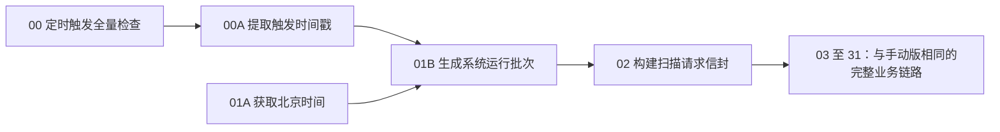

# 流程 01：预警派工与知识随单（定时触发版）

## 流程信息

- 平台智能体 / 工作流名称：`MoldGuard_报工AI审核预警派工与知识随单-定时触发`
- Flow ID：`33ba2057-9074-45c4-ae39-fcff9a14a859`
- 当前可见节点数：51
- 当前连线数：56
- 后端地址：`https://moldguard.oracle.19970219.xyz`
- 平台知识库：`模具保养知识库`
- 知识目录版本：`MOLDGUARD-KB-1.2`
- 平台实装核对日期：`2026-08-15`

本流程不是旧的五节点“定时器心跳探测”。它是流程 01 手动版的完整副本，只把人工聊天入口替换为定时入口；扫描、自动派工、知识检索与整理、知识快照回写、任务卡预览和 Django 发信均与手动版一致。

完整业务节点、提示词、端口和故障排查以 [02_流程01_预警派工与知识随单.md](./02_流程01_预警派工与知识随单.md) 为准。本文只记录定时版与手动版的差异。

## 与手动版的结构差异

手动版是 50 个节点、55 条连线。定时版执行以下替换：

```text
删除：01_输入检查指令
删除：01.message -> 01B.start_command

增加：00_定时触发全量检查.result
增加：00A.parsed_text
增加：00.result -> 00A.input_data
增加：00A.parsed_text -> 01B.start_command
```

因此：

```text
50 - 1 + 2 = 51 个节点
55 - 1 + 2 = 56 条连线
```

## 定时入口节点

平台当前显示名按画布原样记录，不另外创造名称。

| 文档编号 | 节点类型 | 平台当前显示名 | 用途 |
|---|---|---|---|
| 00 | 定时触发器 | `00_定时触发全量检查.result` | 注册 APScheduler 任务并按配置唤醒本流程 |
| 00A | 解析器 | `00A.parsed_text` | 从触发 Data 提取时间戳，生成批次前缀 |
| 01A | 当前日期 | `01A_获取北京时间` | 提供本次运行的北京时间 |
| 01B | 提示词 | `01B_生成系统运行批次` | 拼接定时触发文本和当前时间，交给扫描请求信封 |

## 当前实装配置

### 00 定时触发器

```text
触发类型 = interval
间隔（秒） = 8
Cron 表达式 = */1 * * * *
消息内容 = DAILY_MOLD_SCAN
操作 = 启动
```

当前选择的是 `interval`，所以画布里保存的 Cron 表达式不参与调度。`DAILY_MOLD_SCAN` 只是消息标签；当前实际频率不是每天一次，而是每 8 秒一次。

### 00A 解析器

```text
模式 = 整理模式 (Parser)
模板 = 定时检查-{timestamp}
数据源 <- 00.result
解析后的文本 -> 01B.start_command
```

### 01A、01B 系统运行批次

```text
01A.current_date -> 01B.current_date
00A.parsed_text -> 01B.start_command
01B 模板 = FLOW01-{start_command}-{current_date}
01B.prompt -> 02.demo_run_id
```

节点 02 仍使用“扫描预警”请求类型，不传 `mold_ids`，由 Django 扫描全部非禁用模具。

## 定时版入口图



## 56 条连线的核对方法

定时版的第 3 条至第 56 条业务连线，与手动版 55 条连线表中的第 2 条至第 55 条完全相同。只替换入口：

| 定时版 # | 从：节点.输出端口 | 到：节点.输入端口 | 说明 |
|---:|---|---|---|
| 1 | `00.result` | `00A.input_data` | 把定时触发 Data 交给原生解析器 |
| 2 | `00A.parsed_text` | `01B.start_command` | 使用 `定时检查-{timestamp}` 作为启动指令 |
| 3 | `01A.current_date` | `01B.current_date` | 提供北京时间；对应手动版第 2 条 |

后续从 `01B.prompt -> 02.demo_run_id` 开始，逐条照抄手动版连接表。不要再保留聊天输入到 `01B.start_command` 的连线，也不要把定时触发器直接连接请求信封。

## 启停操作

首次启用：

1. 保持节点 00 的“操作”为“启动”。
2. 手动运行一次节点 00，确认结果状态为 `started`、`already_running` 或 `rescheduled`。
3. 查看平台运行记录，确认定时任务实际唤醒 Flow ID `33ba2057-9074-45c4-ae39-fcff9a14a859`。
4. 再确认扫描请求、知识回写和发信链路没有因为缺少批次而失败。

停止：

1. 把节点 00 的“操作”改为“停止”。
2. 再手动运行一次节点 00。
3. 确认结果为 `stopped` 或 `not_found`，并检查后续不再出现新定时运行。

同一 Flow ID 只应有一个活动定时器。重复启动相同配置应返回 `already_running`；配置变化后重新启动应返回 `rescheduled`。

## 频率安全

当前 8 秒间隔只适合短时间比赛联调。它会反复执行真实的扫描、派工、知识回写和发信链路，不是只读心跳：

- 启用前确认使用演示数据和授权测试邮箱。
- 联调时持续观察 Django 幂等返回和邮件状态。
- 完成演示后立即按“停止”步骤关闭调度器。
- 若要改为每天 08:00，应把触发类型改为 `cron`、Cron 表达式改为 `0 8 * * *`，再手动运行一次使任务重排；该配置是后续建议，不是当前画布实装值。

## 验收清单

```text
[ ] Flow ID 为 33ba2057-9074-45c4-ae39-fcff9a14a859
[ ] 画布共有 51 个可见节点和 56 条连线
[ ] 定时入口只有 00 -> 00A -> 01B 两条新增连线
[ ] 01A.current_date 仍连接 01B.current_date
[ ] 01B.prompt 仍连接 02.demo_run_id
[ ] 扫描请求不传 mold_ids
[ ] 后续节点、提示词、知识库和发信链路与手动版一致
[ ] 当前 8 秒测试完成后已停止定时器
```
