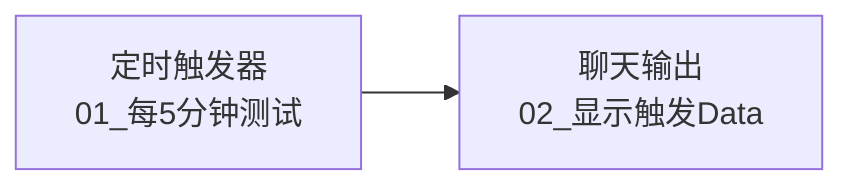
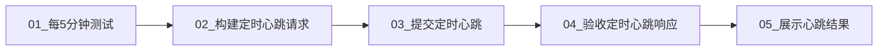

# 流程 04：定时器心跳探测

## 流程信息

- 平台流程名称：`MoldGuard_04_定时器心跳探测`
- 最终节点数：5
- 验证能力：P12 定时调用
- 后端地址：`https://moldguard.oracle.19970219.xyz`
- 自定义节点源码：`../比赛平台_自定义节点/`

本流程必须分两步搭建。先观察真实定时器 Data，再在请求适配器中选择真实证据字段；不能提前猜字段。

## 第一步：两节点观察版

### 节点清单

| 编号 | 节点类型 | 节点名称 |
|---:|---|---|
| 01 | 定时触发器 | `01_每5分钟测试` |
| 02 | 聊天输出 | `02_显示触发Data` |



### 定时器配置

```text
触发类型：cron
Cron表达式：*/5 * * * *
消息内容：SCHEDULER_TICK
操作：启动
```

配置后必须手动运行一次，确认返回以下之一：

```text
started
already_running
rescheduled
```

记录节点 02 展示的完整真实 Data 字段。

## 第二步：最终五节点版

确认真实 Data 后，将流程改为：

| 编号 | 节点类型 | 节点名称 |
|---:|---|---|
| 01 | 定时触发器 | `01_每5分钟测试` |
| 02 | MoldGuard 请求适配器 | `02_构建定时心跳请求` |
| 03 | JSON HTTP 请求 | `03_提交定时心跳` |
| 04 | MoldGuard 响应适配器 | `04_验收定时心跳响应` |
| 05 | 聊天输出 | `05_展示心跳结果` |



### 02_构建定时心跳请求

- 节点：`MoldGuard 请求适配器`
- 请求类型：`定时心跳`
- 定时器数据：`01.result`
- 工单 ID / 探测 run_id：填写流程 00 返回的真实 `run_id`
- 证据字段路径：填写第一步观察到且始终存在的字段，例如真实存在时可填 `timestamp`
- 客户端请求 ID：可留空；留空时节点根据 `run_id + 证据值`生成每次触发唯一的 ID

节点生成：

```text
URL = https://moldguard.oracle.19970219.xyz/api/v1/probe/scheduler-heartbeat
```

```jsonc
{
  "run_id": "<流程00真实run_id>",
  "platform_name": "competition-agent-platform",
  "evidence": "<从真实定时器Data选择的字段值>",
  "client_request_id": "<run_id>-scheduler-<证据值>"
}
```

不要把敏感字段或整包定时器 Data 当作 evidence；只选择时间戳、触发类型等安全标量。

### 03_提交定时心跳

- 方法：`POST`
- URL：`02.url`
- Body：`02.json_body`
- 请求头：`Content-Type: application/json`

### 04_验收定时心跳响应

- 节点：`MoldGuard 响应适配器`
- 响应类型：`定时心跳响应`
- HTTP 响应：`03.response`
- 成功条件：`HTTP 200 + SUCCESS`

### 05_展示心跳结果

- 输入：`04.result`

## 验收与收尾

1. 一次成功响应即可作为 P12 证据。
2. 将能力报告中的 P12 按真实结果回写。
3. 比赛验证完成后，如果不需要持续定时运行，把节点 01 的操作改为“停止”并再手动运行一次。
