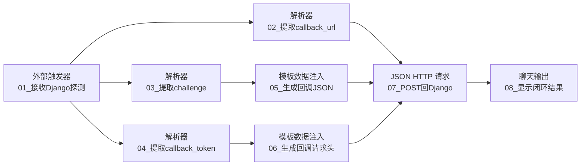

# 临时流程：Webhook 往返测试

## 用途

- 平台流程名称：`MoldGuard_TEST_Webhook往返`
- 节点数：8
- 是否为比赛必搭流程：否
- 验证链路：`Django POST 平台 Webhook -> 平台 POST Django callback -> Django 记录 COMPLETED`

本流程只验证 HTTP 往返，不读取或修改工单、员工报工、图片、知识包和邮件数据。测试地址使用独立配置 `MOLDGUARD_WEBHOOK_PROBE_URL`，不要填入正式报工审核流程的地址。

## 节点清单

| 编号 | 节点类型 | 节点名称 |
|---:|---|---|
| 01 | 外部触发器（Webhook） | `01_接收Django探测` |
| 02 | 解析器 | `02_提取callback_url` |
| 03 | 解析器 | `03_提取challenge` |
| 04 | 解析器 | `04_提取callback_token` |
| 05 | 模板数据注入 | `05_生成回调JSON` |
| 06 | 模板数据注入 | `06_生成回调请求头` |
| 07 | JSON HTTP 请求 | `07_POST回Django` |
| 08 | 聊天输出 | `08_显示闭环结果` |



## 节点配置

### 01_接收Django探测

保存外部触发器后，复制平台生成的 Webhook endpoint。把这个 endpoint 配置为 Django 的：

```text
MOLDGUARD_WEBHOOK_PROBE_URL=<平台生成的Webhook endpoint>
```

必须填写平台最终 endpoint；Django 的探测请求不会跟随 3xx 重定向。

Django 发来的 JSON 只包含探测定位信息、一次性令牌和回调地址：

```json
{
  "event": "WEBHOOK_ROUNDTRIP_PROBE",
  "probe_id": "WHP-...",
  "challenge": "...",
  "callback_url": "https://moldguard.oracle.19970219.xyz/api/v1/webhook-probes/WHP-.../callback",
  "callback_token": "...",
  "callback_token_header": "X-MoldGuard-Callback-Token",
  "expires_at": "...",
  "client_request_id": "webhook-probe-dispatch-WHP-..."
}
```

不要把 `01.data` 直接连接到聊天输出，否则一次性令牌会出现在流程结果中。

### 02、03、04 三个解析器

三个解析器的输入都连接 `01.data`：

- `02` 模板：`{callback_url}`
- `03` 模板：`{challenge}`
- `04` 模板：`{callback_token}`

### 05_生成回调JSON

```json
{
  "client_request_id": "webhook-probe-callback-{challenge}",
  "challenge": "{challenge}",
  "platform_name": "competition-agent-platform",
  "evidence": "WEBHOOK_ROUNDTRIP_OK"
}
```

`challenge <- 03.message`

### 06_生成回调请求头

```text
X-MoldGuard-Callback-Token: {callback_token}
```

`callback_token <- 04.message`

### 07_POST回Django

- 方法：`POST`
- URL：`02.message`
- 请求体：`05.text`
- 自定义请求头：`06.text`
- 超时：`10`
- 跟随重定向：关闭

节点会自动补充 `Content-Type: application/json`。

### 08_显示闭环结果

- 输入：`07.data`
- 预期 HTTP 状态：`200`
- 预期 `body.code`：`SUCCESS`
- 预期 `body.data.roundtrip_status`：`COMPLETED`

## 发起测试

部署并配置 Django 后执行：

```bash
curl -X POST \
  https://moldguard.oracle.19970219.xyz/api/v1/webhook-probes \
  -H 'Content-Type: application/json' \
  -d '{"client_request_id":"webhook-roundtrip-20260814-001"}'
```

保存响应里的 `probe_id`，再查询：

```bash
curl https://moldguard.oracle.19970219.xyz/api/v1/webhook-probes/<probe_id>
```

## 验收

以下三个字段同时满足才表示整条链路正常：

```text
dispatch_status = DELIVERED
callback_status = COMPLETED
roundtrip_status = COMPLETED
```

`DELIVERED` 只证明平台的 Webhook endpoint 返回了 2xx；只有 `roundtrip_status=COMPLETED` 才证明平台成功 POST 回 Django。令牌默认 600 秒过期，且只能成功消费一次。
